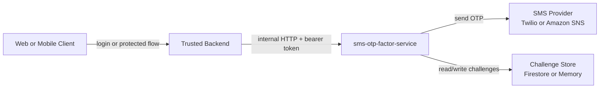
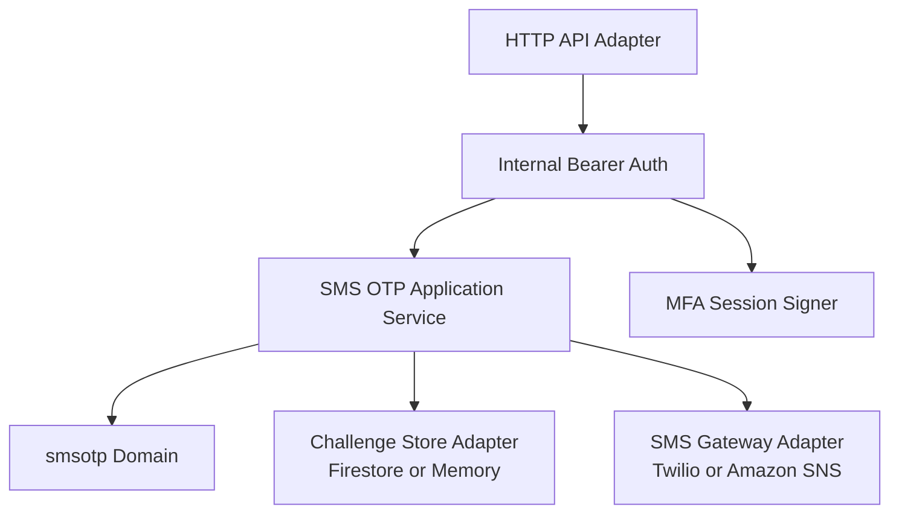
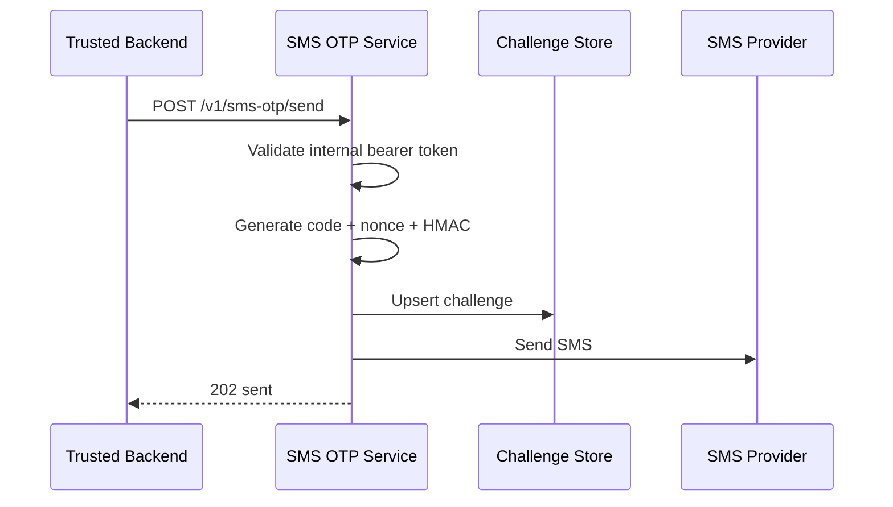
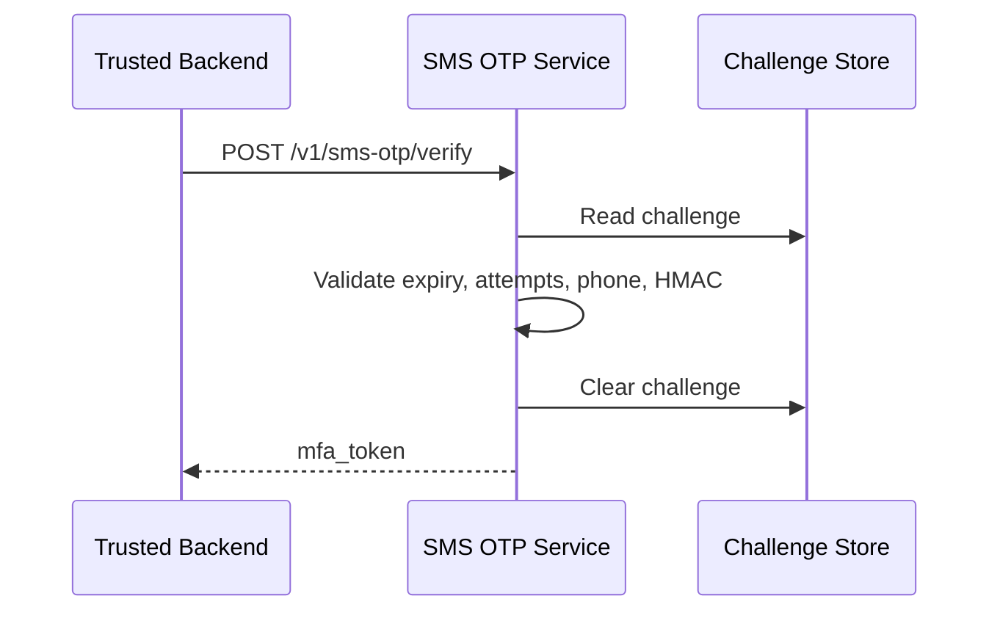
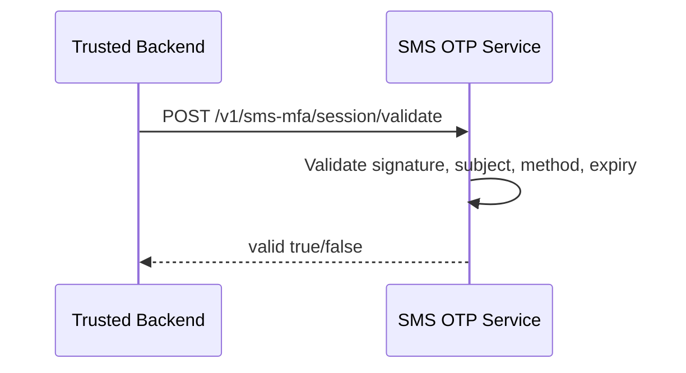

# Architecture Description - SMS OTP Factor Service

Normative frame: ISO/IEC/IEEE 42010 architecture description using C4 Model views.

System of interest: `sms-otp-factor-service`.

Status: Public reference implementation.

Date: 2026-07-16

Repository: `github.com/inceptionlabscorp/sms-otp-factor-service`.

## 1. Purpose

This architecture description defines an independent SMS OTP factor microservice. The service owns OTP challenge lifecycle, SMS delivery, OTP verification, short-lived MFA token signing, and MFA token validation.

The implementation follows tactical DDD for the `smsotp` bounded context and hexagonal architecture. Domain and application code define policy and ports; HTTP, storage, Twilio, and Amazon SNS are adapters.

A trusted backend remains responsible for primary authentication, user authorization, and authorized phone-number policy. Browser and mobile clients do not call this service directly.

## 2. Stakeholders And Concerns

| Stakeholder | Concerns |
| --- | --- |
| Backend engineer | Stable internal HTTP contract, predictable error mapping, clear caller responsibilities. |
| Security reviewer | OTP never stored in clear text, phone number cannot be user-overridden, secrets stay outside the repo. |
| Operator/on-call | Health, deployment, rollback, provider switching, rate-limit behavior. |
| API consumer | OpenAPI contract, integration examples, BIAN-aligned endpoint aliases. |
| Product owner | SMS OTP can be introduced without coupling to a specific identity provider. |

## 3. Architecture Concerns

| ID | Concern | Response |
| --- | --- | --- |
| C-01 | SMS OTP must be independent from application-specific backends. | Dedicated service with generic API and provider adapters. |
| C-02 | The trusted backend must remain the authority. | Service accepts `subject_id` and `phone_number` only from authenticated backend callers. |
| C-03 | OTP must not be stored in clear text. | Challenges store HMAC, nonce, expiry, attempt count, and cooldown data. |
| C-04 | MFA session semantics must be encapsulated. | Service signs and validates short-lived `mfa_token` values. |
| C-05 | Provider outage should be isolated. | `SMS_PROVIDER` selects Twilio or Amazon SNS without changing domain code. |
| C-06 | Service contract must be private. | All `/v1/*` endpoints require `SMS_OTP_SERVICE_API_TOKEN`. |
| C-07 | Banking-style contract semantics should be explicit. | Adds BIAN-aligned aliases using Customer Access Entitlement language while preserving canonical endpoints. |

## 4. Viewpoints

| Viewpoint | Concern | C4 view |
| --- | --- | --- |
| System Context | Service boundary and external systems. | C4 Level 1 |
| Container | Runtime pieces and stores. | C4 Level 2 |
| Component | Code modules. | C4 Level 3 |
| Dynamic | Send, verify, validate session. | Sequence views |
| Deployment | Cloud Run, store, secrets, SMS provider. | Deployment view |
| Operations | Validation and rollback. | Runbook view |

## 5. C4 Level 1 - System Context



Boundary rule: clients never call the SMS OTP service directly.

## 6. C4 Level 2 - Containers



| Container | Responsibility |
| --- | --- |
| HTTP API adapter | JSON endpoints, routing, and error mapping. |
| Internal bearer auth | Validates `SMS_OTP_SERVICE_API_TOKEN`. |
| Application service | Runs send and verify OTP use cases through ports. |
| Domain model | Defines challenge, policy, defaults, and domain errors. |
| Session service | Signs and validates SMS MFA session tokens. |
| SMS provider adapter | Sends SMS through Twilio Messaging Service or Amazon Simple Notification Service. |
| Store adapter | Persists challenge payloads. |

## 7. C4 Level 3 - Components

| Component | File | Responsibility |
| --- | --- | --- |
| Server bootstrap | `cmd/server/main.go` | Reads env, wires dependencies, starts HTTP server. |
| Domain challenge | `internal/domain/smsotp/challenge.go` | Challenge aggregate state and invariants. |
| Domain policy | `internal/domain/smsotp/policy.go` | OTP TTL, rate limits, attempts, and session TTL defaults. |
| Application use cases | `internal/application/smsotp/usecases.go` | Send and verify OTP orchestration through ports. |
| Application ports | `internal/application/smsotp/ports.go` | Challenge repository, SMS gateway, and code generator contracts. |
| Session service | `internal/application/smsotp/session.go` | HMAC-signed `mfa_token`. |
| HTTP adapter | `internal/adapters/httpapi/handler.go` | Implements `/health` and `/v1/*`. |
| Firestore adapter | `internal/adapters/store/firestore.go` | Production challenge repository. |
| Memory adapter | `internal/adapters/store/memory.go` | Test/local repository only. |
| Twilio adapter | `internal/adapters/sms/twilio/client.go` | Twilio raw SMS transport. |
| Amazon SNS adapter | `internal/adapters/sms/sns/client.go` | Amazon Simple Notification Service SMS transport with SigV4 signing. |

Dependency rule: `domain` has no dependency on application or adapters; `application` depends only on `domain`; adapters depend inward on application/domain.

## 8. Dynamic View - Send OTP



## 9. Dynamic View - Verify OTP



## 10. Dynamic View - Validate Session



## 11. Deployment View

| Runtime item | Value |
| --- | --- |
| Container service | `sms-otp-factor-service` |
| Store | `STORE_DRIVER=firestore` for production; `memory` for local development. |
| SMS provider | `SMS_PROVIDER=twilio` or `SMS_PROVIDER=amazon_sns`. |
| Caller | Trusted backend. |

Secrets:

- `SMS_OTP_SERVICE_API_TOKEN`
- `SMS_OTP_SECRET`
- `SMS_MFA_SESSION_SECRET`
- Twilio credentials when `SMS_PROVIDER=twilio`
- Amazon SNS credentials when `SMS_PROVIDER=amazon_sns`

## 12. Architecture Decisions

| ID | Decision | Rationale | Consequence |
| --- | --- | --- | --- |
| ADR-SMS-001 | Backend calls service; clients do not. | Backend remains authority for identity, role, and authorized phone. | The service stays reusable and private. |
| ADR-SMS-002 | Service signs SMS MFA token. | Token semantics belong to the SMS factor bounded context. | Backend delegates validation instead of parsing token internals. |
| ADR-SMS-003 | Firestore REST adapter for Cloud Run deployments. | Keeps dependency surface small and avoids binding domain code to infrastructure SDKs. | Adapter must handle metadata access tokens. |
| ADR-SMS-004 | Bearer token for service-to-service auth. | Simple private API boundary for backend integration. | Token must be rotated through secret management. |
| ADR-SMS-005 | BIAN-aligned aliases coexist with canonical endpoints. | BIAN provides banking terminology and action semantics while canonical endpoints remain stable. | BIAN aliases are available but not certified BIAN APIs. |
| ADR-SMS-006 | SMS providers are adapters behind a port. | Provider choice is infrastructure, not domain policy. | Twilio and Amazon SNS can be switched by config. |

## 13. Correspondence Rules

| Rule | Required behavior |
| --- | --- |
| CR-01 | `/v1/*` endpoints must reject missing or invalid service tokens. |
| CR-02 | OTP challenges must never store OTP in clear text. |
| CR-03 | Verify must clear successful or expired challenges. |
| CR-04 | Token validation must check subject, method, signature, and expiry. |
| CR-05 | Logs must not include OTP, token, full phone number, or secrets. |
| CR-06 | Provider adapters must implement the same application port. |

## 14. Validation

```bash
go test ./...
go build ./cmd/server
git diff --check
```

## 15. Rollback

If the service is unavailable:

1. Disable SMS OTP enforcement in the trusted backend.
2. Fall back to another approved second factor if one exists.
3. Keep the service deployed but out of the critical path until fixed.

Do not make clients call the service directly as a rollback mechanism.
