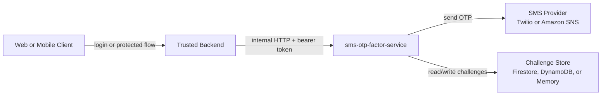
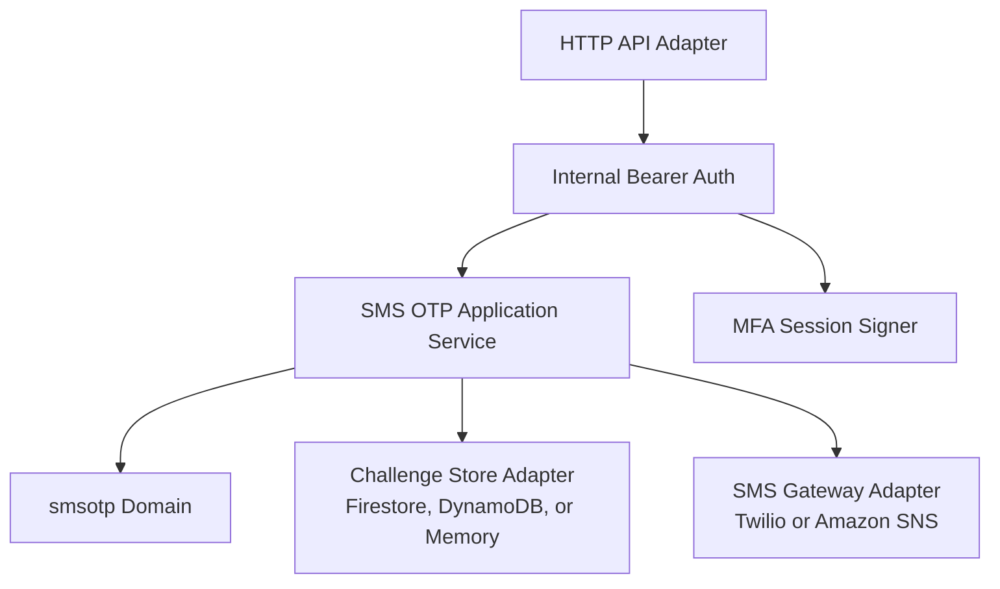
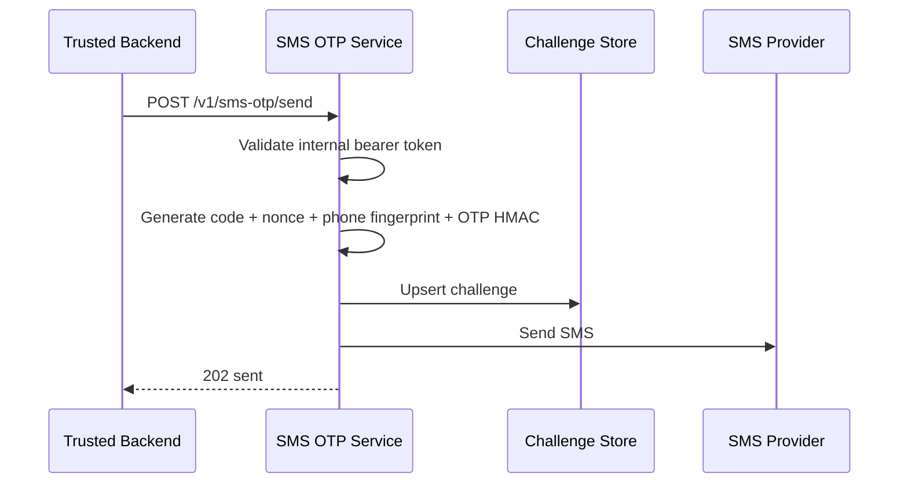
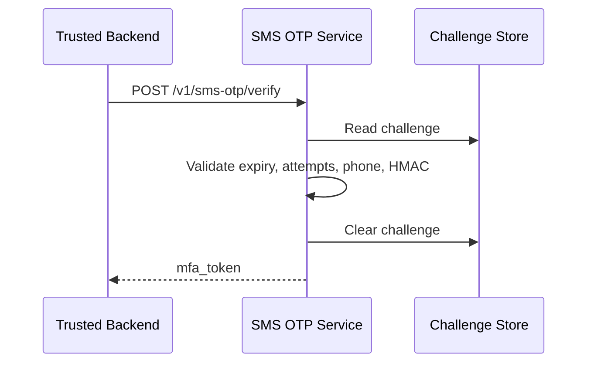

# Descripcion de Arquitectura - SMS OTP Factor Service

English: [Architecture](../architecture.md)

Marco normativo: descripcion de arquitectura ISO/IEC/IEEE 42010 usando vistas C4 Model.

Sistema de interes: `sms-otp-factor-service`.

Estado: implementacion publica de referencia.

Fecha: 2026-07-16

Repositorio: `github.com/inceptionlabscorp/sms-otp-factor-service`.

## 1. Proposito

Esta descripcion define un microservicio independiente de factor SMS OTP. El servicio controla el ciclo de vida del challenge OTP, envio SMS, verificacion OTP, firma de token MFA de corta duracion y validacion de token MFA.

La implementacion sigue DDD tactico para el bounded context `smsotp` y arquitectura hexagonal. Dominio y aplicacion definen politicas y puertos; HTTP, storage, Twilio y Amazon SNS son adapters.

Un backend confiable sigue siendo responsable de autenticacion primaria, autorizacion de usuario y politica de telefono autorizado. Clientes web y moviles no llaman este servicio directamente.

## 2. Stakeholders y Concerns

| Stakeholder | Concerns |
| --- | --- |
| Backend engineer | Contrato HTTP estable, errores predecibles y responsabilidades claras del caller. |
| Security reviewer | OTP no se guarda en claro, telefono no puede ser sobrescrito por usuario, telefono raw no se guarda en challenges y secretos quedan fuera del repo. |
| Operator/on-call | Health, deploy, rollback, cambio de proveedor y rate limits. |
| API consumer | OpenAPI, ejemplos de integracion y aliases BIAN-aligned. |
| Product owner | SMS OTP puede introducirse sin acoplarse a un identity provider especifico. |

## 3. Concerns de Arquitectura

| ID | Concern | Respuesta |
| --- | --- | --- |
| C-01 | SMS OTP debe ser independiente de backends especificos. | Servicio dedicado con API generica y adapters de proveedor. |
| C-02 | El backend confiable debe seguir siendo autoridad. | El servicio acepta `subject_id` y `phone_number` solo desde callers backend autenticados. |
| C-03 | OTP y telefonos no deben guardarse en claro. | Challenges guardan OTP HMAC, fingerprint HMAC del telefono, nonce, expiracion, intentos y cooldown. |
| C-04 | La semantica de sesion MFA debe estar encapsulada. | El servicio firma y valida `mfa_token` de corta duracion. |
| C-05 | Outage de proveedor debe aislarse. | `SMS_PROVIDER` selecciona Twilio o Amazon SNS sin cambiar dominio. |
| C-06 | El contrato debe ser privado. | Todos los endpoints `/v1/*` requieren `SMS_OTP_SERVICE_API_TOKEN`. |
| C-07 | Semantica bancaria debe ser explicita. | Aliases BIAN-aligned usando Customer Access Entitlement y endpoints canonicos. |
| C-08 | SMS no debe exagerarse como alto aseguramiento. | SMS OTP se documenta como factor out-of-band restringido y se requieren alternativas phishing-resistant para flujos regulados de alto riesgo. |

## 4. Viewpoints

| Viewpoint | Concern | Vista C4 |
| --- | --- | --- |
| System Context | Frontera del servicio y sistemas externos. | C4 Level 1 |
| Container | Piezas runtime y stores. | C4 Level 2 |
| Component | Modulos de codigo. | C4 Level 3 |
| Dynamic | Enviar, verificar y validar sesion. | Secuencias |
| Deployment | Cloud Run/App Runner, store, secretos, proveedor SMS. | Deployment |
| Operations | Validacion y rollback. | Runbook |

## 5. C4 Level 1 - System Context



Regla de frontera: los clientes nunca llaman directamente al servicio SMS OTP.

## 6. C4 Level 2 - Containers



| Container | Responsabilidad |
| --- | --- |
| HTTP API adapter | Endpoints JSON, routing y mapeo de errores. |
| Internal bearer auth | Valida `SMS_OTP_SERVICE_API_TOKEN`. |
| Application service | Ejecuta casos de uso send/verify OTP via puertos. |
| Domain model | Define challenge, validacion telefono/codigo, politica, defaults y errores. |
| Session service | Firma y valida tokens MFA SMS. |
| SMS provider adapter | Envia SMS por Twilio Messaging Service o Amazon SNS. |
| Store adapter | Persiste challenges en Firestore, DynamoDB o memoria local. |

## 7. C4 Level 3 - Componentes

| Componente | Archivo | Responsabilidad |
| --- | --- | --- |
| Server bootstrap | `cmd/server/main.go` | Lee env, cablea dependencias e inicia HTTP server. |
| Domain challenge | `internal/domain/smsotp/challenge.go` | Estado e invariantes del aggregate challenge. |
| Domain policy | `internal/domain/smsotp/policy.go` | TTL OTP, rate limits, intentos y TTL de sesion. |
| Application use cases | `internal/application/smsotp/usecases.go` | Orquestacion OTP, HMAC OTP y fingerprint telefonico. |
| Session service | `internal/application/smsotp/session.go` | Token `mfa_token` firmado con HMAC. |
| HTTP adapter | `internal/adapters/httpapi/handler.go` | Implementa `/health` y `/v1/*`. |
| Firestore adapter | `internal/adapters/store/firestore.go` | Store productivo en GCP. |
| DynamoDB adapter | `internal/adapters/store/dynamodb.go` | Store productivo en AWS con SigV4. |
| Memory adapter | `internal/adapters/store/memory.go` | Store local/test. |
| Twilio adapter | `internal/adapters/sms/twilio/client.go` | Transporte SMS Twilio raw. |
| Amazon SNS adapter | `internal/adapters/sms/sns/client.go` | Transporte SMS Amazon SNS con SigV4. |

Regla de dependencia: `domain` no depende de aplicacion ni adapters; `application` depende solo de `domain`; adapters dependen hacia adentro.

## 8. Dynamic View - Enviar OTP



## 9. Dynamic View - Verificar OTP



## 10. Deployment View

| Runtime item | Valor |
| --- | --- |
| Container service | `sms-otp-factor-service` |
| Store | `STORE_DRIVER=firestore` en GCP, `STORE_DRIVER=dynamodb` en AWS, `memory` local. |
| SMS provider | `SMS_PROVIDER=twilio` o `SMS_PROVIDER=amazon_sns`. |
| Caller | Backend confiable. |

Secretos:

- `SMS_OTP_SERVICE_API_TOKEN`
- `SMS_OTP_SECRET`
- `SMS_PHONE_HASH_SECRET`
- `SMS_MFA_SESSION_SECRET`
- Credenciales Twilio si `SMS_PROVIDER=twilio`
- Credenciales Amazon SNS solo si no se usan roles AWS

## 11. Decisiones de Arquitectura

| ID | Decision | Rationale | Consecuencia |
| --- | --- | --- | --- |
| ADR-SMS-001 | Backend llama el servicio; clientes no. | Backend conserva autoridad de identidad, rol y telefono. | El servicio permanece reusable y privado. |
| ADR-SMS-002 | El servicio firma token MFA SMS. | La semantica pertenece al bounded context SMS factor. | Backend delega validacion. |
| ADR-SMS-003 | Firestore REST para GCP. | Menor superficie de dependencias. | Adapter maneja metadata tokens. |
| ADR-SMS-004 | Bearer token para service-to-service auth. | Frontera simple para API privada. | Token debe rotarse por secret management. |
| ADR-SMS-005 | Aliases BIAN-aligned junto con endpoints canonicos. | Terminologia bancaria sin romper compatibilidad. | Aliases disponibles, no certificados BIAN. |
| ADR-SMS-006 | Proveedores SMS detras de puerto. | Proveedor es infraestructura, no politica de dominio. | Twilio y Amazon SNS se cambian por config. |
| ADR-SMS-007 | Guardar HMAC de telefono, no telefono raw. | Minimiza PII en stores sensibles. | Verify recomputa fingerprint. |
| ADR-SMS-008 | Requerir alternativas phishing-resistant en flujos regulados de alto riesgo. | SMS no es phishing-resistant. | Bancos usan SMS solo donde riesgo aceptado lo permite. |
| ADR-SMS-009 | DynamoDB como store productivo AWS. | AWS no debe depender de Firestore ni memoria. | App Runner usa role credentials y DynamoDB. |

## 12. Validacion

```bash
go test ./...
go build ./cmd/server
git diff --check
```
